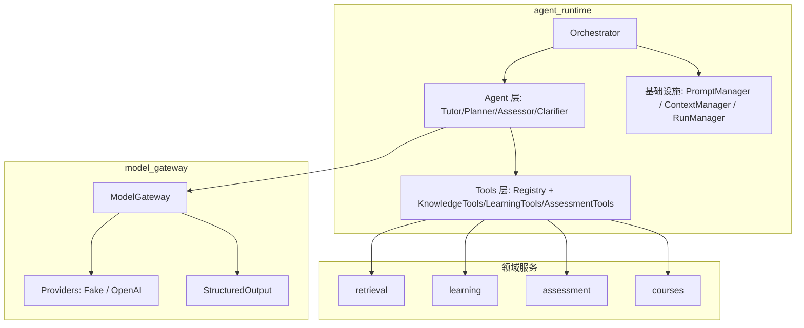

## 产品概述

Mentora Agent 运行时框架 Phase 1：构建后端 Agent 基础设施，包括多 Agent 调度、Function Calling 工具调用、提示词管理和上下文预算控制。核心交付为架构设计文档和可运行的 Agent 核心骨架（含 model_gateway 模块）。

> **状态：已完成**（2026-06-17）。实现记录见 [implementation-log.md](../../project-management/implementation-log.md)。

## 核心功能

### 架构设计文档

- 完整的 Agent 运行时架构设计，覆盖模块架构、Agent 体系、Tool 机制、提示词管理、上下文管理、数据模型、API 设计
- 与现有模块（workflow_runtime、model_gateway、retrieval、learning、assessment、courses）的集成边界说明
- 四阶段实施路线（Phase 1-4）

### model_gateway 模块

- 与模型厂商无关的统一调用接口：`gateway.chat(messages, tools, ...)` 
- BaseProvider 抽象 + FakeProvider（确定性测试用）+ OpenAIProvider 骨架
- ModelRequest / ModelAttempt 审计模型与数据库迁移
- Pydantic 结构化输出校验
- 基本路由（task_type → provider）

### agent_runtime 核心

- **Agent 基类**：无状态 Agent，接收 AgentInput 返回 AgentOutput
- **Orchestrator**：单 Agent 模式（直接路由）+ Pipeline 模式（预定义步骤依次执行）
- **TutorAgent**：教学 Agent，可用 retrieve_evidence 工具
- **Tool 注册表**：ToolDefinition（name/description/parameters JSON Schema），按 Agent 角色过滤
- **PromptManager**：YAML 模板加载、变量渲染、版本管理
- **ContextManager**：上下文窗口预算控制，P0-P4 优先级裁剪
- **RunManager**：运行记录持久化（OrchestratorRun → SubAgentRun → ToolInvocation）
- **SSE 事件**：agent.run.started / thinking / tool.call / tool.result / completed

### 受控工具循环流程

```
OrchestratorTask → 上下文组装 → 模型调用 → tool_calls 检测 → 工具执行 → 结果回填 → 继续推理（max N 轮） → 结构化输出
```

### 视觉呈现（无前端，仅后端逻辑）

所有 Agent 推理结果以结构化 JSON 返回（含引用的 evidence_id、citations 等），通过 SSE 事件流实时推送进度。

## 技术栈选择

- **后端框架**：Django 5 + Django REST Framework
- **异步任务**：Celery + Redis
- **数据验证**：Pydantic v2（跨模块 DTO 和结构化输出校验）
- **数据库**：PostgreSQL（审计模型用 JSONB 字段）
- **LLM 协议**：OpenAI 兼容 Function Calling（tools 参数 + tool_calls 响应）
- **测试**：pytest + FakeProvider（确定性模拟）

## 实现方法

### model_gateway 设计策略

采用「任务声明 → 路由 → 提供方执行」的间接层模式。领域服务通过 `model_gateway.chat(task_type, messages, tools, ...)` 声明需求，网关内部根据 `task_type` 路由到对应 Provider。FakeProvider 在测试中返回预定义响应，验证 Agent 逻辑而不依赖真实 LLM。

关键决策：

- 不直接暴露 Provider SDK 给领域模块
- ModelAttempt 记录每次实际网络调用（供审计和成本结算）
- 结构化输出校验在 Provider 返回后立即执行，不进入领域逻辑

### agent_runtime 设计策略

复用项目现有模式：Django AppConfig 注册、Celery shared_task 桥接、Pydantic Schema 定义 DTO。Agent 是无状态纯函数，每次 run 接收完整上下文，返回结构化输出。Orchestrator 统一管理工具调用循环和 SSE 事件发射。

关键决策：

- Agent 代码不 import 领域模型（Course、Topic 等），通过 Tool.execute() 间接调用领域服务
- Pipeline 模式用 Python 数据类定义步骤，不在数据库中存储工作流定义
- 上下文预算用粗略 Token 估算（字符数/4），不引入 tiktoken 依赖

### 性能考虑

- 工具调用循环有硬上限（默认 5 轮），防止无限循环
- 工具结果超长时写入 Artifact，仅返回 artifact_id 引用
- PromptManager 缓存已加载的 YAML 模板，避免重复 IO
- Token 计数器用简单估算算法，O(n) 扫描消息列表

## 架构设计

### 系统架构图



### 数据流

```
workflow_runtime / API
  → Orchestrator.run(task)
    → ContextManager.build_context(task) 
    → Agent.run(context)
      → [循环] model_gateway.chat(messages, tools) 
        → Provider.chat() → LLM 响应
      → ToolRegistry.execute(tool_name, args)
        → DomainService → 结构化结果
    → AgentOutput + 审计记录持久化
  → OrchestratorResult + SSE events
```

## 实施细节

### 目录结构

```
docs/architecture/
└── agent-runtime-design.md          # [NEW] 完整架构设计文档，14 章结构

apps/api/mentora/model_gateway/       # [NEW] 整个模块从零新建
├── __init__.py                       # 模块文档（约定/约束/@module）
├── apps.py                           # Django AppConfig
├── gateway.py                        # ModelGateway 主入口：chat() 方法
├── router.py                         # 任务路由：task_type → provider
├── structured_output.py              # Pydantic JSON Schema 校验器
├── models.py                         # ModelRequest, ModelAttempt
├── schemas.py                        # ChatRequest, ChatResponse, ToolCall 等 DTO
├── providers/
│   ├── __init__.py
│   ├── base.py                       # BaseProvider 抽象类
│   └── fake.py                       # FakeProvider：确定性测试响应
└── migrations/
    └── __init__.py

apps/api/mentora/agent_runtime/       # [MODIFY] 扩展已有骨架
├── __init__.py                       # [MODIFY] 更新 docstring
├── apps.py                           # 已有，不变
├── tasks.py                          # [MODIFY] 添加 run_agent Celery task
├── models.py                         # [NEW] OrchestratorRun, SubAgentRun, ToolInvocation, PromptRevision
├── services.py                       # [NEW] RunManager：运行记录 CRUD
├── events.py                         # [NEW] SSE 事件发射器
├── agents/
│   ├── __init__.py                   # [NEW]
│   ├── base.py                       # [NEW] Agent 抽象基类 + AgentInput/AgentOutput
│   ├── orchestrator.py               # [NEW] Orchestrator：单 Agent + Pipeline 模式
│   └── tutor.py                      # [NEW] TutorAgent 实现
├── tools/
│   ├── __init__.py                   # [NEW]
│   ├── base.py                       # [NEW] ToolDefinition, Tool, ToolResult, ToolContext
│   ├── registry.py                   # [NEW] ToolRegistry
│   └── knowledge_tools.py            # [NEW] RetrieveEvidenceTool 等
├── prompts/
│   ├── __init__.py                   # [NEW]
│   ├── manager.py                    # [NEW] PromptManager：YAML 加载/缓存/渲染
│   ├── schema.py                     # [NEW] PromptTemplate 数据类
│   └── templates/
│       └── tutor.yaml                # [NEW] TutorAgent 系统提示词模板
├── context/
│   ├── __init__.py                   # [NEW]
│   ├── manager.py                    # [NEW] ContextManager：预算控制+裁剪
│   └── token_counter.py              # [NEW] Token 估算器
├── schemas/
│   ├── __init__.py                   # [NEW]
│   ├── task.py                       # [NEW] OrchestratorTask, PipelineStep
│   ├── output.py                     # [NEW] AgentOutput, OrchestratorResult
│   └── context.py                    # [NEW] AgentContext, ToolContext
└── migrations/
    └── __init__.py                   # 已有
```

### 关键代码结构

**Agent 基类接口**：

```python
class Agent(ABC):
    role: str
    system_prompt_ref: str
    tool_names: set[str]
    
    @abstractmethod
    async def run(self, input: AgentInput) -> AgentOutput: ...
```

**Tool 定义**：

```python
@dataclass
class ToolDefinition:
    name: str                    # 唯一标识
    description: str             # 人类可读描述
    parameters: dict             # JSON Schema
    agent_roles: set[str]        # 允许使用的 Agent
    requires_confirmation: bool  # 写操作需确认
    timeout_seconds: float = 30.0
```

**Pipeline 模式**：

```python
@dataclass
class PipelineStep:
    agent_role: str
    task_instruction: str
    input_from: str | None
    output_key: str
    max_tool_rounds: int = 5
```

**模型网关调用签名**：

```python
class ModelGateway:
    async def chat(
        self,
        task_type: str,
        messages: list[Message],
        tools: list[dict[str, Any]] | None = None,
        structured_output_schema: type[BaseModel] | None = None,
    ) -> ChatResponse:
        """统一模型调用入口。"""
```

### 测试策略

- **FakeProvider**：预置多组 tool_calls 和纯文本响应的模拟数据，涵盖单轮/多轮/无工具/工具失败等场景
- **单元测试**：ToolRegistry 注册与调用、PromptManager 模板渲染、ContextManager 预算裁剪、Token 计数器
- **集成测试**：Orchestrator + TutorAgent + FakeProvider 端到端：用户提问 → 触发 retrieve_evidence → 模型总结 → 返回带引用的答案
- **模型测试**：Django 审计模型的 CRUD 和状态迁移

### 性能注意事项

- YAML 模板在 PromptManager 初始化时一次性加载到内存缓存，运行时只做变量渲染
- Token 计数用 `len(text) // 4` 近似算法，不设外部依赖
- 工具结果 > 64KB 时自动写入 common.storage（Artifact），仅返回引用
- 非流式输出（Phase 1 默认非流式）简化实现复杂度

## 使用的 Agent 扩展

### Skill

- **writing-plans**
- 用途：在开始编码前，产出完整的实施计划，确保任务分解合理、依赖关系清晰
- 预期结果：生成可执行的阶段计划，明确每个文件的实现顺序和内容

- **brainstorming**
- 用途：在设计 model_gateway 和 agent_runtime 的核心接口时，进行方案推演和取舍分析
- 预期结果：确认关键接口设计（gateway.chat 签名、Agent 基类、Tool 协议、Pipeline 模式）的合理性

- **test-driven-development**
- 用途：在编写 Core Skeleton 实现代码前，先编写 FakeProvider 驱动的测试用例，确保设计可验证
- 预期结果：每个核心模块都有先行测试，覆盖正向路径和边界条件

- **subagent-driven-development**
- 用途：Phase 1 中 model_gateway 和 agent_runtime 两个模块可并行实现（独立目录，共享 Schema 定义在两个模块中分别定义）
- 预期结果：两个模块独立开发、独立测试，最后集成验证