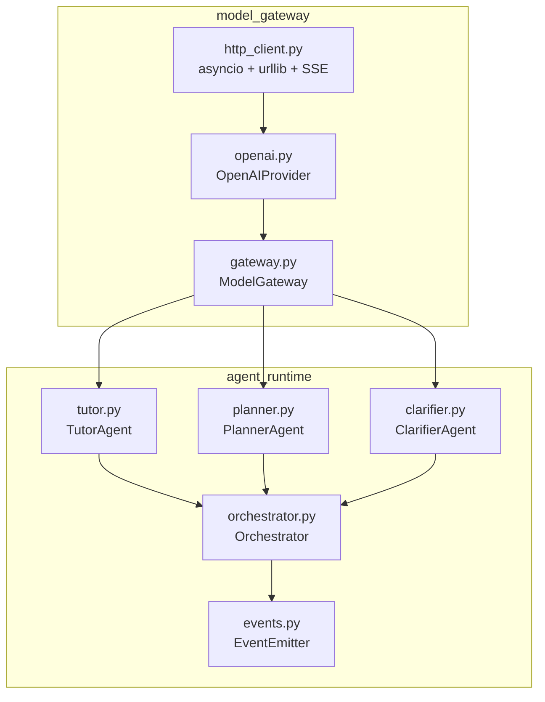

## 产品概述

Agent Runtime Phase 2：在 Phase 1 骨架基础上，接入真实 LLM（OpenAI 兼容 API），实现 SSE 流式输出，新增 PlannerAgent 与 ClarifierAgent，完成 Pipeline 模式端到端串联。

## 核心功能

### OpenAIProvider

- 实现 `BaseProvider`，通过 OpenAI 兼容 API 调用真实 LLM
- 支持 Function Calling（`tools` 参数 + `tool_calls` 响应）
- 非流式 `chat()` 与流式 `chat_stream()` 双模式
- API Key / Base URL / Model 通过 Django settings 环境变量注入，用户后续填入

### SSE 流式输出

- `BaseProvider` 新增可选 `chat_stream()` 方法，`FakeProvider` 同步补齐
- `ModelGateway` 新增 `chat_stream()`，含审计记录
- `EventEmitter` 新增 `agent_response_stream` 事件，逐 chunk 发射
- `TutorAgent` 支持流式模式，工具调用循环中每个 chunk 实时推送

### PlannerAgent + ClarifierAgent

- **PlannerAgent**：基于用户目标和资料生成学习计划，使用 `retrieve_evidence` 工具
- **ClarifierAgent**：当用户意图模糊时提出澄清问题，纯文本交互
- 对应 JSON 提示词模板 + ToolRegistry 注册

### Pipeline 模式完整实现

- 增强 Orchestrator pipeline 错误处理：单步失败可终止或跳过
- 端到端 Pipeline 集成测试（Clarifier → Planner → Tutor）
- `EventEmitter` 新增 `agent.step.started/completed` 事件

## 技术栈

- **语言**：Python 3.12+（asyncio 原生）
- **Web 框架**：Django 5.2 + DRF
- **HTTP 客户端**：自建（`asyncio.to_thread` + `urllib.request` 用于非流式，`asyncio.open_connection` + `ssl` 用于 SSE 流式）
- **数据校验**：Pydantic v2
- **测试**：pytest + pytest-django + pytest-asyncio
- **约束**：禁止安装任何外部 HTTP 库（`openai`/`httpx`/`aiohttp` 均不可用）

## 实现策略

### 自建异步 HTTP 客户端

由于环境无法安装任何 HTTP 库，构建轻量级异步 HTTP 层：

**非流式请求**（`model_gateway/providers/http_client.py`）：

```python
# async_post_json() 内部用 asyncio.to_thread 包装 urllib.request
# 输入：url, payload dict, headers dict
# 输出：parsed JSON dict
# 超时：30s
```

**流式 SSE 请求**（`model_gateway/providers/http_client.py`）：

```python
# async_post_sse() 使用 asyncio.open_connection + SSL
# 手动构造 HTTP/1.1 POST 请求
# 逐行读取响应，解析 SSE 格式（data: {...}\n\n）
# 返回 AsyncGenerator[dict, None]
```

选择 `asyncio.open_connection` 而非第三方库的理由：

1. Python 3.12+ stdlib 完全可行，不需要额外依赖
2. 手动 SSE 解析逻辑约 50 行，复杂度可控
3. 避免线程池 + 同步 IO 导致的流式阻塞问题

### OpenAIProvider 设计

```python
class OpenAIProvider(BaseProvider):
    name = "openai"
    default_model = "gpt-4o-mini"

    def __init__(self, api_key: str, base_url: str | None = None, model: str | None = None):
        # base_url 默认 "https://api.openai.com/v1"
        # 实际请求路径：{base_url}/chat/completions
        # 通过环境变量 LLM_API_KEY / LLM_API_BASE_URL / LLM_MODEL 注入

    async def chat(self, messages, tools=None, model=None) -> ProviderResponse:
        # 非流式：POST JSON → 解析 choices[0].message
        # 解析 content + tool_calls → ProviderResponse

    async def chat_stream(self, messages, tools=None, model=None) -> AsyncGenerator[ProviderResponse, None]:
        # 流式：POST JSON (stream:true) → SSE 逐块解析
        # 每个 chunk 构建 ProviderResponse（delta content / tool_calls）
        # finish_reason 在最后 chunk 中设置
```

### 流式架构

```
OpenAIProvider.chat_stream()
  → async_post_sse() 逐 chunk 返回
  → 每个 chunk 解析为 ProviderResponse（含 delta content/tool_calls）
  → ModelGateway.chat_stream() 逐个 yield ChatResponse
  → Agent.run_stream() 逐个消费：
      - 非工具调用 chunk → EventEmitter.agent_response_stream()
      - 工具调用完成 → 执行工具 → 继续下一轮
      - 最终 chunk → AgentOutput
```

**关键决策**：

- `BaseProvider.chat_stream()` 为可选方法（默认 `raise NotImplementedError`），不破坏现有 `FakeProvider` 兼容性
- 流式 chunk 的 `ProviderResponse.tool_calls` 需要在最后一个 chunk 汇总（OpenAI 流式协议：tool_calls 的 delta 在多个 chunk 中逐字段补全）
- `EventEmitter` 新增 `agent_response_stream(task_id, text_chunk, is_final)` 事件

### PlannerAgent 与 ClarifierAgent

继承 `Agent` 基类，遵循 Phase 1 的 TutorAgent 模式：

- 构造函数注入 `PromptManager`, `ToolRegistry`, `ModelGateway`
- `run()` 实现工具调用循环（ClarifierAgent 不需要工具循环）
- `PlannerAgent.tool_names = {"retrieve_evidence"}`
- `ClarifierAgent.tool_names = set()`（纯文本）

## 架构设计

### 模块依赖



### 数据流（流式模式）

```
用户请求 → Orchestrator.run(task)
  → Agent.run_stream(input)
    → ModelGateway.chat_stream(...)
      → OpenAIProvider.chat_stream(...)
        → async_post_sse(url, payload, headers)
          → asyncio.open_connection + SSL → 逐行 SSE 解析
        → yield ProviderResponse(chunk)
      → yield ChatResponse(chunk)
    → for each chunk:
        if content: EventEmitter.agent_response_stream()
        if final: 聚合 tool_calls → 执行工具 → 回填 → 下一轮
  → AgentOutput
```

## 实现细节

### 目录结构

```
apps/api/mentora/
├── model_gateway/
│   ├── providers/
│   │   ├── __init__.py          # [MODIFY] 导出 OpenAIProvider
│   │   ├── base.py              # [MODIFY] 新增 chat_stream() 可选方法
│   │   ├── fake.py              # [MODIFY] 新增 chat_stream() 实现
│   │   ├── http_client.py       # [NEW] 异步 HTTP 客户端（非流式 + SSE 流式）
│   │   └── openai.py            # [NEW] OpenAIProvider（非流式 + 流式）
│   ├── gateway.py               # [MODIFY] 新增 chat_stream() 方法
│   └── schemas.py               # [MODIFY] 新增 StreamChunk DTO
│
├── agent_runtime/
│   ├── agents/
│   │   ├── __init__.py          # [MODIFY] 导出 PlannerAgent, ClarifierAgent
│   │   ├── base.py              # 不变
│   │   ├── orchestrator.py     # [MODIFY] Pipeline 错误处理增强 + run_stream
│   │   ├── tutor.py             # [MODIFY] 新增 run_stream() 方法
│   │   ├── planner.py           # [NEW] PlannerAgent
│   │   └── clarifier.py         # [NEW] ClarifierAgent
│   ├── prompts/templates/
│   │   ├── planner.json         # [NEW] PlannerAgent 系统提示词
│   │   └── clarifier.json       # [NEW] ClarifierAgent 系统提示词
│   └── events.py                # [MODIFY] 新增流式 + Pipeline 事件
│
├── config/
│   └── settings.py              # [MODIFY] 新增 LLM 配置 section
│
└── tests/
    └── test_agent_runtime.py    # [MODIFY] 新增 Phase 2 测试（OpenAIProvider、流式、新Agent、Pipeline）
```

### 关键实现注意点

**性能**：

- 流式 SSE 解析逐行处理，不缓存完整响应体到内存
- OpenAI tool_calls delta 聚合使用 O(1) 索引查找（以 `tool_call.index` 为键）
- `asyncio.to_thread` 用于非流式请求，避免阻塞事件循环

**日志**：

- HTTP 请求/响应不在日志中记录完整 body（避免泄露 prompts 和 API Key）
- 错误日志仅记录 HTTP 状态码和错误类型，不含 API Key

**向后兼容**：

- `BaseProvider.chat()` 签名不变
- `chat_stream()` 为可选方法，现有 `FakeProvider` 不受影响
- `TutorAgent.run()` 不变，`run_stream()` 为新增方法
- Pipeline 模式增强不影响单 Agent 模式

**安全**：

- API Key 通过 `os.getenv("LLM_API_KEY")` 读取，不硬编码
- `settings.py` 中配置读取环境变量，有合理默认值和缺失提示
- 审计记录中不存储 API Key

## Agent Extensions

### Skill

- **writing-plans**
- 目的：梳理 Phase 2 各子任务的依赖关系和执行顺序，确保 plan 可执行
- 预期结果：输出结构化实施计划，明确各步骤的前置条件和产出物

- **test-driven-development**
- 目的：在实现每个模块前先编写测试，确保 OpenAIProvider、流式、新 Agent、Pipeline 均通过测试驱动开发
- 预期结果：每个模块均有对应的 pytest 用例，覆盖正常路径和错误路径

- **verification-before-completion**
- 目的：在每个子任务完成后运行测试验证，确保不引入回归
- 预期结果：所有 Phase 1 测试（25 个）继续保持通过，新增 Phase 2 测试全部通过