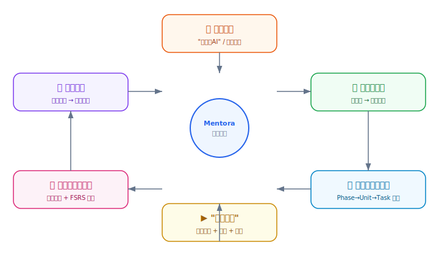
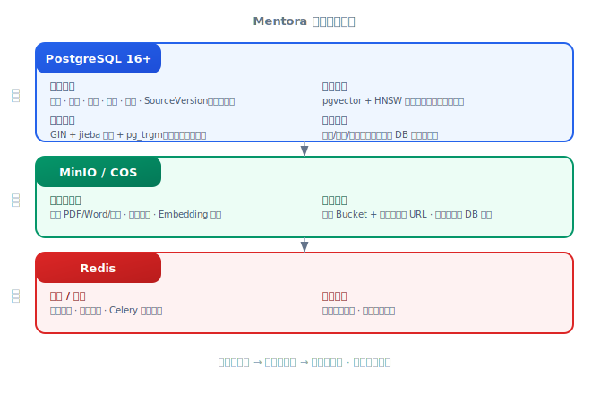
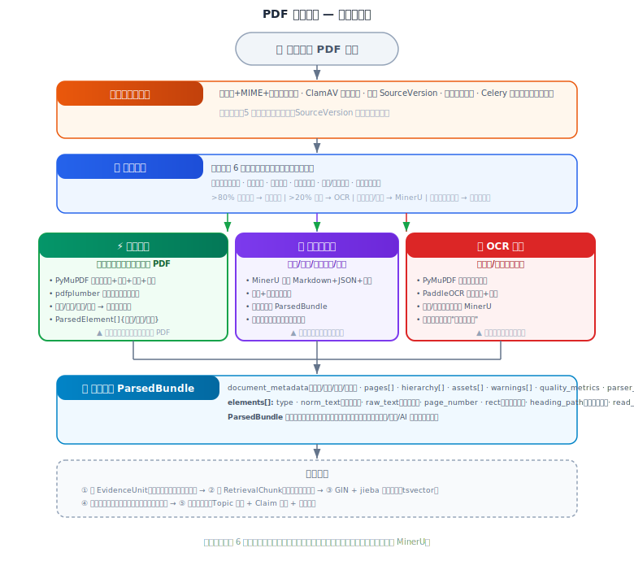
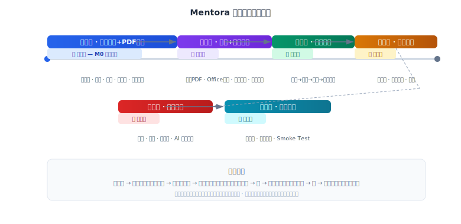

# Mentora 需求分析文档

> V1.0 | 2026-06-24 | 待评审

## 1. 项目定位

**Mentora** = 以课程为单位的 AI 学习工作台。不是通用聊天机器人，不是文档知识库。

核心闭环：用户给出模糊诉求 → 结构化澄清 → 可编辑学习计划 → "继续学习" → 基于原文证据的讲解/练习 → 多维掌握度评估 → 调整路径。



### 核心痛点

| 痛点 | Mentora 方案 |
| --- | --- |
| 资料碎片化（PDF/Word/PPT/视频散落） | 用户级资源库统一上传、解析、索引 |
| 不知道每天该学什么 | 确定性调度器 + 模型润色 → 可编辑路径卡片 |
| AI 回答不可信 | 每个回答引用原文页码/坐标/时间点 |
| "看完"当学会 | 多维证据（回忆/练习题/迁移题/间隔复习）加权计算掌握度 |
| 千篇一律 | 基于目标、基础、时间预算个性化生成 |

### 目标用户

大学生（期末/考研）、职场学习者（快速入门）、自由学习者（兴趣探索）、教师（备课参考）。

---

## 2. 功能需求总览

| 模块 | 核心能力 | 技术方案 | 优先级 | 阶段 |
| --- | --- | --- | --- | --- |
| **资源库** | 上传(PDF/Word/PPT/视频/网页)、文件夹/标签整理、版本管理(不可变SourceVersion)、生命周期(停用/删除/清理) | MinIO/COS（文件存储）· PG（版本与血缘管理）· ClamAV+libmagic（安全扫描与格式校验） | P0 | M0 |
| **资料解析** | PDF三路径(快速/高质量/OCR)、Office(DOCX/PPTX/XLSX)、图片/视频、网页抓取 → 统一ParsedBundle | PyMuPDF / MinerU / PaddleOCR（PDF三引擎按复杂度自动路由）· Docling+python-docx/pptx/openpyxl（Office解析）· FFmpeg+ASR（视频抽帧+语音转文字）· httpx+trafilatura+Playwright（网页抓取与正文提取） | P0 | M0 |
| **课程创建** | 结构化问题卡澄清(非自由聊天)、可编辑画像面板(目的/时间/范围/基础)、画像冻结确认 | Django REST（API）· Celery（异步澄清任务）· model_gateway（AI 结构化 JSON 输出，Schema 硬约束防跑偏） | P0 | M3 |
| **知识作用域** | 课程选择资料(role+选择器+版本策略)、不可变版本快照、乐观锁+checksum防冲突、影响分析 | PG（乐观锁+事务原子切换）· Celery（异步影响分析）· pgvector（向量相似度辅助过滤） | P0 | M0 |
| **证据追踪与引用** | 混合检索(关键词+pgvector+RRF融合)、结构化引用(evidence_unit_id→页码/坐标/幻灯片/时间点)、TurnEvidenceSnapshot不可变快照、引用ID服务端校验(不靠正则)、前端渲染跳转(PDF高亮/PPT定位/视频跳转) | pgvector HNSW（语义搜索）· PG GIN+pg_trgm+jieba（全文搜索+中文分词）· RRF（融合排序）· React PDF.js（前端定位跳转） | P0 | M0 |
| **学习计划** | 确定性调度(拓扑+预算+覆盖)、Phase→Unit→Task三层可拖拽卡片、不可行时给降级方案 | Celery（异步生成骨架）· model_gateway（AI 润色解释）· React Flow+ELK.js（可视化拖拽编辑） | P0 | 二 |
| **学习执行** | "继续学习"一键推进、学习包(原文+讲解+例题+练习+引用)、AI Tutor带引用问答 | SSE（流式输出，打字机效果）· TanStack Query（前端状态管理）· model_gateway（AI 导师 Agent 带引用回答） | P0 | 二 |
| **测评&掌握度** | 统一题目模型(生命周期+验证等级)、AI动态出题(答案优先→独立盲解→歧义攻击→题型硬验证)、多维证据加权+FSRS复习调度 | model_gateway（AI 出题+自动评分+答案验证）· FSRS（间隔复习调度）· Redis（防并发答题状态缓存） | P1 | 二 |
| **知识地图** | 课程主题图展示(掌握度状态/前置关系/资料覆盖/下一步操作)、Topic从课程作用域和用户明确输入中产生 | React Flow+ELK.js（图谱节点连线可视化）· KaTeX（公式渲染）· model_gateway（AI 从资料提取主题与前置关系） | P1 | M3 |
| **网络推荐** | 多源搜索(通用/YouTube/Semantic Scholar/arXiv)+质量评分(相关度/难度/来源/时效)、安全检查去重、用户采纳后进入课程 | 通用搜索/YouTube/Semantic Scholar/CrossRef/arXiv API（多源聚合）· httpx（内容抓取）· 按相关度/难度/时效评分过滤+安全去重 | P2 | 三 |

### 关键约束

- 资料上传到资源库 ≠ 课程可使用（需显式选择）
- 模型不能搜索用户全部资源，只能访问课程已激活作用域
- 画像确认 ≠ 开始学习，"开始学习"原子激活画像+计划
- 新资料上传不自动覆盖旧版本

---

## 3. 核心模块详析

### 3.1 数据库管理

#### 存储分层



#### 关键数据关系

```
资源库（用户级，不依赖课程）
  library_item ──── source ──── source_version（不可变）
                                    └── parse_run → parsed_bundle → evidence_unit
  
课程（以课程为单位组织学习）
  course
    ├── course_profile_revision（画像版本快照，confirmed→active）
    │     ├── course_profile_candidate（模型候选，待确认）
    │     └── course_profile_field（已确认的字段值）
    ├── course_knowledge_scope_revision（作用域版本快照）
    │     └── course_scope_binding ──── source_version（引用资源库资料）
    ├── learning_plan_revision（计划版本快照）
    │     ├── learning_plan_phase
    │     ├── learning_plan_unit → topic
    │     └── learning_plan_task_template
    └── topic（从作用域资料中提取）
          ├── topic_edge（前置关系）
          └── topic_evidence ──── evidence_unit
```

#### 版本化管理原则

| 对象 | 版本策略 | 说明 |
| --- | --- | --- |
| SourceVersion | 内容变化创建新版本，旧版本不可变 | 解析/OCR/Embedding 按 source_version_id 缓存 |
| CourseProfileRevision | 确认后冻结为 confirmed，激活后为 active | 不可直接修改 active，只能克隆新草稿 |
| CourseKnowledgeScopeRevision | 一个课程最多一个 active，草稿通过乐观锁编辑 | binding_key 跨修订稳定，激活前需 checksum 一致 |
| LearningPlanRevision | 基于确认画像生成草稿 → 编辑 → 校验 → active | 原子切换画像和计划指针 |
| AssessmentItemRevision | 生命周期受控，发布新版本不影响历史测验 | 隔离坏题可撤销相关掌握证据并重算 |

---

### 3.2 PDF 解析流程

PDF 解析是第一阶段（M0）的核心链路，也是整个资料处理能力的纵向样板。

#### 整体流程



#### 解析结果质量保障

| 指标 | 目标 | 度量方式 |
| --- | --- | --- |
| 文字覆盖率 | ≥95%（快速路径）| 预检文本比例 |
| 标题层级准确率 | ≥90% | 人工标注基准集 |
| 阅读顺序准确率 | ≥85% | 人工标注基准集 |
| 公式识别率 | ≥80%（MinerU路径）| 公式数对比 |
| 引用定位成功率 | ≥90% | 跳转后页面+坐标校验 |

---

## 4. 非功能性需求

### 安全（P0）

- Electron: `nodeIntegration:false, contextIsolation:true, sandbox:true`
- Preload typed contextBridge 白名单；Renderer 零信任无 Node
- Token 存 Main Process safeStorage；API Bridge 只接受相对路径
- 大文件流式上传预签名 URL，不解码 base64 穿 IPC
- 上传三重校验(扩展名/MIME/魔数) + ClamAV

### 性能（P1）

- PDF 快速解析 ≤ [TBD]秒/页
- 问答首字流式延迟 ≤ [TBD]秒
- >100MB 文件分片上传可恢复

### 可用性（P1）

- 单实例运行；上传中关闭需确认
- SSE 断线自动恢复；错误信息对用户可理解

---

## 5. 技术栈与接口

| 层 | 选型 |
| --- | --- |
| 客户端 | Electron(Windows 10/11) + React 19 + TypeScript + Vite |
| 后端 | Python 3.11+ / Django 5 + DRF |
| 数据库 | PostgreSQL 16+ + pgvector |
| 缓存/队列 | Redis + Celery |
| 存储 | MinIO(开发)/COS(生产) |
| 解析 | PyMuPDF / MinerU / PaddleOCR / Docling / FFmpeg |
| 通信 | Renderer→Preload(IPC)→Main→REST/SSE→Django |

关键 API 端点：`/library/*` `/courses/*` `/knowledge-scope/*` `/learning-*` `/assessment-*` `/uploads` `/auth/login`

---

## 6. 分阶段交付

| 阶段 | 范围 | 状态 |
| --- | --- | --- |
| **一** | 工程基线+PDF处理链路(桌面壳/上传/解析/作用域/引用问答) | 🔄 进行中 |
| **二** | 扫描PDF+Office+主题模型+知识地图 | ⬜ |
| **三** | 完整建课(澄清→画像→计划→原子启动) | ⬜ |
| **四** | 学习闭环(学习包/任务/追问) | ⬜ |
| **五** | 测评闭环(测验/评分/掌握度/AI出题) | ⬜ |
| **六** | 发布候选(安装包/更新/Smoke Test) | ⬜ |



### M0 验收关键项

- 上传 PDF + 课程选择 + 解析查看 + 引用回答 + 引用跳转
- Renderer 无法访问 Node/令牌/本地路径
- 大文件流式上传不穿 IPC base64
- 未绑定 PDF 不能被课程检索命中
- 草稿乐观锁 412 / 激活冲突 409 / 历史回答可定位作用域+版本

---

## 7. 风险与待确认

### 主要风险

| 风险 | 缓解 |
| --- | --- |
| 解析质量不稳定 | 三路径自动选择 + 基准集回归 |
| 模型输出不可控 | JSON Schema 硬约束 + 结构化引用协议 |
| 模型成本过高 | 分层缓存 + 小模型处理简单任务 + Embedding 复用 |

### 待评审确认

| # | 事项 | 建议 |
| --- | --- | --- |
| Q1 | PDF 文件大小/页数限制 | 500页/200MB |
| Q2 | 首版音频支持 | 推迟到阶段三 |
| Q3 | 登录方式 | 仅邮箱注册 |
| Q4 | 性能 SLA 数值 | 需评审定 |
| Q5 | 首版网络推荐 | 建议推迟 |
| Q6 | 官方基础库来源 | 需确认版权 |

---

## 附录

### 团队分工

| 角色 | 负责 |
| --- | --- |
| WH (组长) | 架构、Django 服务、数据、工作流、Electron、Infra |
| LBZ | React Renderer、UX、前端测试 |
| LH | 资料接入、解析、证据、检索评测 |
| LWJ | 模型网关、画像提取、计划生成、Tutor、题目验证 |

### 参考

- [端到端方案](../architecture/end-to-end-implementation-plan.md)
- [团队章程](team-charter.md) | [交付路线图](delivery-roadmap.md) | [M0任务](stage-01-backlog.md)
- [桌面架构](../architecture/desktop-client-architecture.md) | [作用域设计](../architecture/scope-versioning-design.md) | [题库设计](../architecture/assessment-item-bank-design.md)
